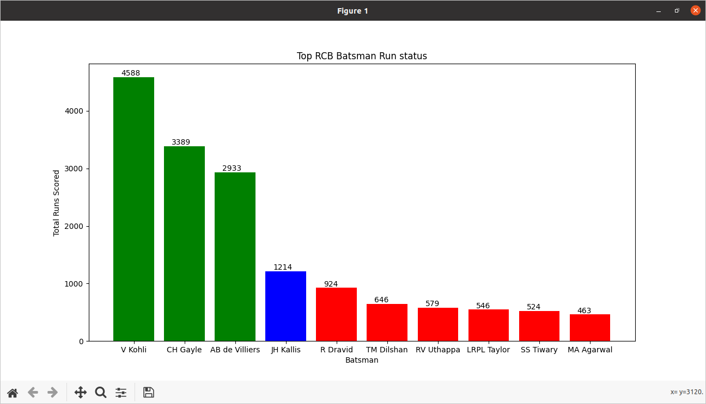
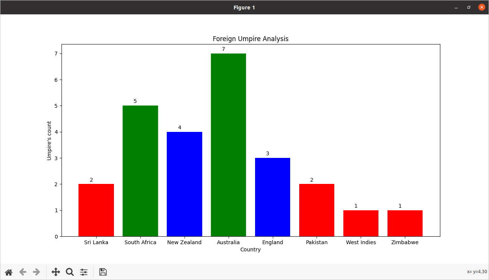
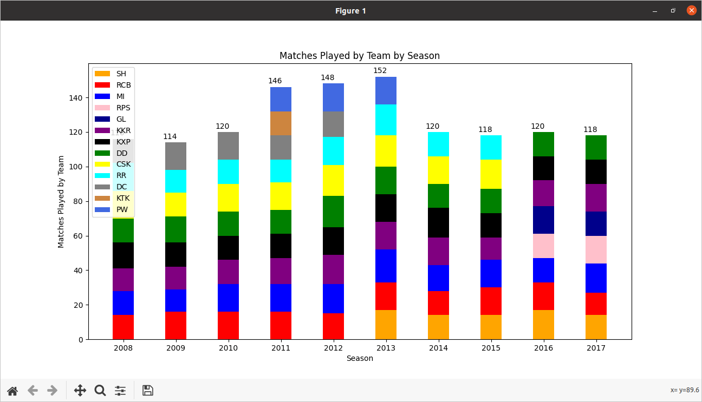

# Dataproject :: python
# IPL-ANALYSIS-Python

This repo consists of a source code of a python script to make specific anaylsis in IPL dataset using **Datastructure**.

](https://en.wikipedia.org/wiki/Indian_Premier_League)

## How is it done?

You might be wondering on how graphs were plotted on raw dataset is done, well it aint that complicated as you may think.

We all all know that computer are good at numbers, so in order to plot graph we were designing a definite structure to the data in this case
we used dictionaries , for plotting graph we used matplotlib .

This repo consist of a basic example on how to do that.


## Getting started

To get started with the code on this repo, you need to either *clone* or *download* this repo into your machine just as shown below;

```bash
git clone git@gitlab.com:mountblue/cohort-16-python/gopinath_v/dataproject-python.git
```

## Dependencies 

Before you begin playing with the source code you might need to install the following libaries just as shown below;

```bash
pip install matplotlib
```

## Running the App

To run this code you need to have to download  and  csv files and place these dataset in the same directory. If you want to **install and setup virtualenv** follow from **step 1** or if you want to **directly run it in editor** follow from **step2**.
## step1
### Install the virtualenv package
```bash
pip install virtualenv
```
### Create the virtual environment
To create a virtual environment, you must specify a path. You may provide any name in the place of <mypython>:
```bash
virtualenv <mypython>
```
  
### Activate the virtual environment
```bash
source mypython/bin/activate
```
  
## step2
  
```bash
$-> cd IPL-ANALYSIS-Python
$ cd IPL-ANALYSIS-Python-> python3 total_runs.py

```
]

```bash
$ cd IPL-ANALYSIS-Python-> python3 rcb_top_batsman.py

```
]
```bash
$ cd IPL-ANALYSIS-Python-> python3 foreign_umpire.py

```
]
```bash
$ cd IPL-ANALYSIS-Python-> python3 total_matches_by_team.py

```
]

### Deactivate the virtual environment
if you have followed step1 use this command to get out of virtualenv
```bash
deactivate

```


